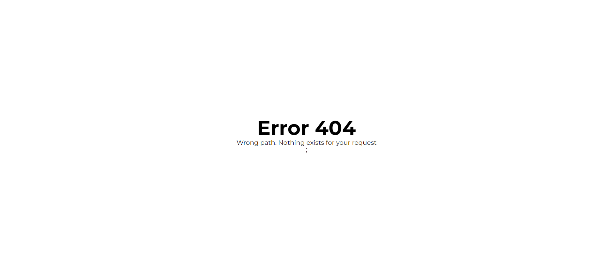

# Phonebook application

### Link to gh-pages
https://m-farmaha.github.io/phonebook-fe/

Welcome to personal contacts book on the web.

After authorization, you'll have access to an interface where you can easily add, delete, and modify your personal contacts, securely storing them on a remote web server.

Don't forget your password!

## Review

- Login page

- Register page

- Contacts page

- Modal window

- Error page

This is a repository that uses the following technologies:

#### Frontend:

 - **react**
- **react router dom**
- **redux / RTK query**
- **styled components**
- **responsive markup**

#### Backend:

- **node.js**
- **express**
- **mongoBD / mongoose**

## How to Contribute

If you wish to make your own fixes or improvements, you should:

1. Clone the repository to your computer.
2. Make changes and additions to the source code.
3. Test to ensure everything works correctly.
4. Submit a pull request with your changes.

## Author

The "Phonebook" is developed by M-Farmaha in 2023.

## License

This project is distributed under the MIT License.

## Recommended Browser

We recommend using Google Chrome for the best experience when using our app.
