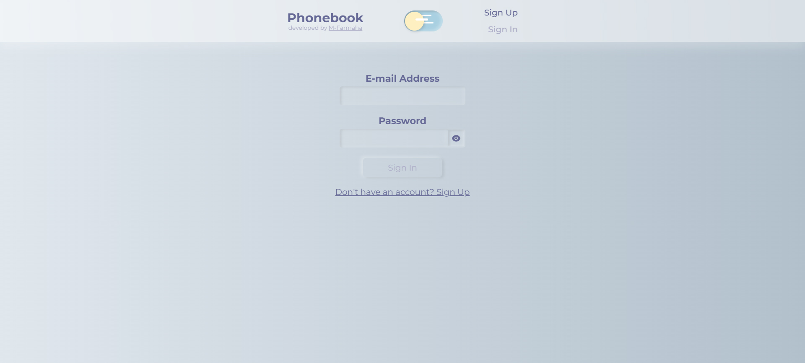
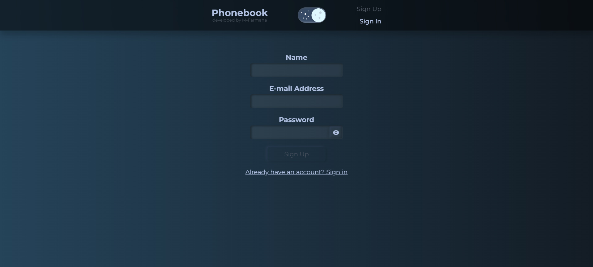
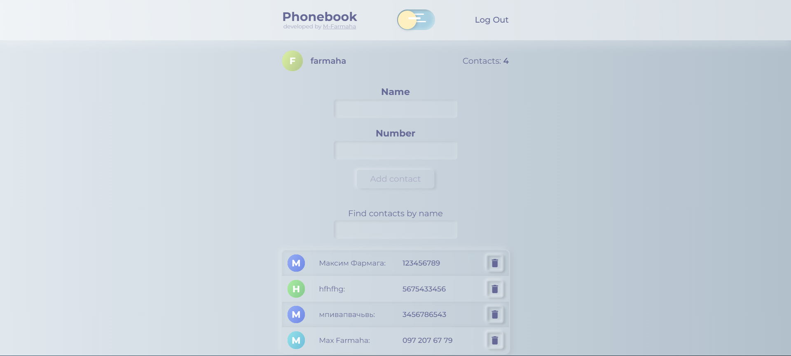
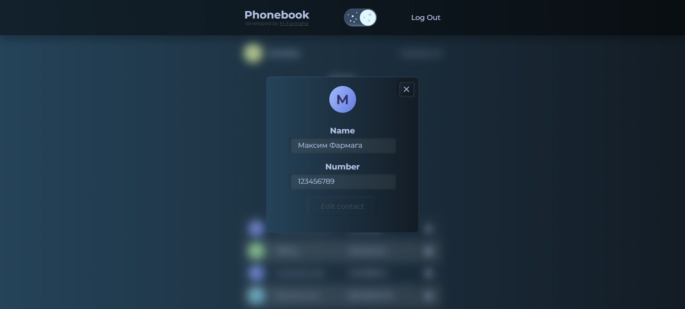

# Phonebook application

### Link to gh-pages
https://m-farmaha.github.io/goit-react-hw-08-phonebook/

Welcome to personal contacts book on the web.
CRUD backend interaction, error handling, routing, authentication and authorization, theme switching, quick notifications.

## Review

- Login page

- Register page

- Contacts page

- Modal window

This is a repository that uses the following technologies:

#### Frontend:

 - **react**
- **react router dom**
- **redux / RTK query**
- **styled components**
- **responsive markup**

#### Backend:

- **node.js**
- **express**
- **mongoBD / mongoose**

## How to Contribute

If you wish to make your own fixes or improvements, you should:

1. Clone the repository to your computer.
2. Make changes and additions to the source code.
3. Test to ensure everything works correctly.
4. Submit a pull request with your changes.

## Author

The "Phonebook" is developed by M-Farmaha in 2023.

## License

This project is distributed under the MIT License.

## Recommended Browser

We recommend using Google Chrome for the best experience when using our app.
